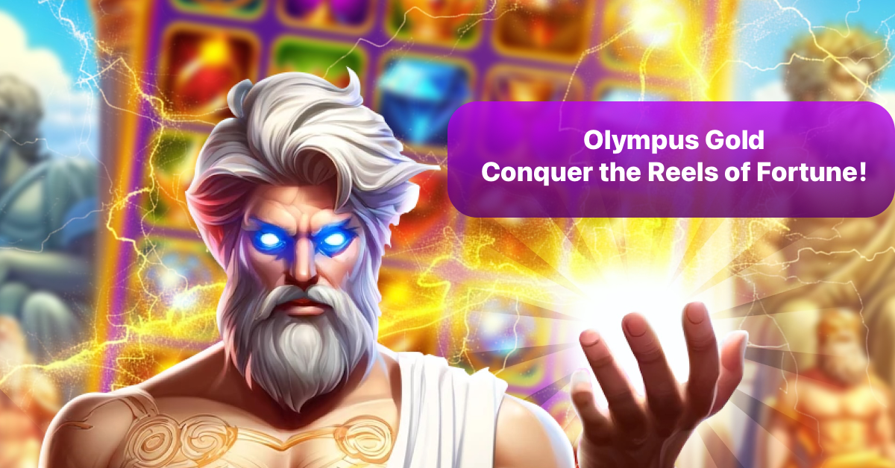

 

# 📣 Summary 
My experience in developing and deploying iOS applications, combined with my problem-solving skills and attention to detail, has enabled me to create high-quality and robust applications. I am a quick learner and always eager to expand my knowledge and skills. I'm a team player who can work effectively with cross-functional teams.

# 🛠️ Tools &nbsp; 

# 🪄 Last Projects!
## [QırımKey - The First Crimean Tatar](https://apps.apple.com/app/id6739430313)
The first iOS keyboard for the Crimean Tatar language, designed to make typing seamless and accessible. As an iOS Developer, I contributed to UI/UX design, integrating a user-friendly interface tailored to the language’s unique needs. I optimized performance, fixed critical bugs, and implemented CI/CD pipelines to streamline development. This open-source project preserves the Crimean Tatar language digitally, combining cultural significance with innovative technology. [Download on the App Store](https://apps.apple.com/app/id6739430313) [View on GitHub](https://github.com/qirimca/Keyboard)

##### 🛠️ Technologies: Swift, UI/UX Design, CI/CD, Fastlane, PostgreSQL KeyboardKit.
##### 📱 Platform: Keyboard utility

## [DriverPro: Plan, Study, Test!](https://appadvice.com/app/driverpro-plan-study-test/6474212227)
DriverPro is your comprehensive guide on the journey to becoming a skilled and confident driver in the Czech Republic. Whether you are a beginner, an experienced driver seeking improvement, or preparing for a driving test, DriverPro simplifies your learning process. Our application follows a simple but effective mantra: Plan,
Study, Test.
Your journey to success on the road begins right now!
Become a professional driver with DriverPro!
[Download the app now!](https://appadvice.com/app/driverpro-plan-study-test/6474212227)

##### 🛠️ Technologies: Swift, SwiftUI, MVVM, Supabase, Notifications, Kingfisher, YoutubePlayerKit.
##### 📱 Platform: iOS & iPadOS

## [AppStore Clone](https://github.com/mustafos/AppStore)
This project was a fantastic opportunity to hone my skills in SwiftUI and Combine, and I also took on the challenge of migrating the application to iOS 17.5. I learned a lot about modern iOS development and the latest advancements in the ecosystem. I'm always looking to improve and would love to hear your feedback! Feel free to clone, fork, and contribute to the project. Let's make it better together! [Available on GitHub](https://github.com/mustafos/AppStore)

##### 🛠️ Technologies: Swift, SwiftUI, Combine, MVVM.
##### 📱 Platform: iOS

## [MarsSnap: Explore, Discover, Share!](https://github.com/mustafos/MarsSnap)
MarsSnap is your gateway to the Red Planet! Get ready for an amazing journey of discovery with our app, where you can explore stunning photos captured directly from Mars. From breathtaking landscapes to fascinating geological features, you'll be amazed by the wonders of another world. With MarsSnap, your journey to Mars begins right in the palm of your hand. Join the adventure, explore the unknown, and share the excitement with friends and fellow space enthusiasts. Get ready to unlock the secrets of the universe with MarsSnap! [👉GitHub repository👈](https://github.com/mustafos/MarsSnap)

##### 🛠️ Technologies: Swift, SwiftUI, Realm, MVVM, Alamofire, Lottie.
##### 📱 Platform: iOS

## [Olympus Gold: Conquer the Reels of Fortune!](https://github.com/mustafos/GateOfOlympus)
Olympus Gold is an exciting mobile game that lets you embark on a thrilling adventure filled with challenges, prizes, and surprises! Spin the Wheel of Fortune, complete levels, and collect rewards while enjoying stunning graphics and smooth animations. With integrated ads from Google Mobile Ads, you can unlock even more content as you play. Whether you're a casual gamer or a competitive player, Olympus Gold offers endless fun and opportunities to win. Get ready to dive into a world of excitement—your journey to Olympus starts now! 
[🎰 Check it out on GitHub 🎰](https://github.com/mustafos/GateOfOlympus)

##### 🛠️ Technologies: Swift, SwiftUI, GoogleAds, In-App Purchase.
##### 📱 Platform: iOS & iPadOS

## [GoogleScrape](https://github.com/mustafos/GoogleScrape)
GoogleScrape is a simple web application designed to fetch and parse organic search results from Google. The application provides a user-friendly interface with an input field where you can enter a search query, and it returns the results from the first page of Google's organic search in a structured format. [🔗Available on GitHub](https://github.com/mustafos/GoogleScrape)

##### 🛠️ Technologies: HTML, CSS, JavaScript, Python, Flask.
##### 🖥️ Platform: Web

## [Portfolio Website](https://mustafos.github.io)
I am pleased to present my portfolio, which represents the culmination of my studies in the renowned CS50 course by Harvard University. It is my hope that this showcase will demonstrate my skills, passion, and dedication to the field of computer science and related disciplines. Each project reflects my commitment to excellence and my thirst for knowledge, as well as my ability to apply theoretical concepts to practical solutions. I invite you to explore the creations born from countless hours of learning. [Go to the web 🌐](https://mustafos.github.io)

##### 🛠️ Technologies: HTML, CSS, JavaScript
##### 🖥️ Platform: Web

# 📱 Contact Me 

 
 

 

# 📊 Stats

 
 

